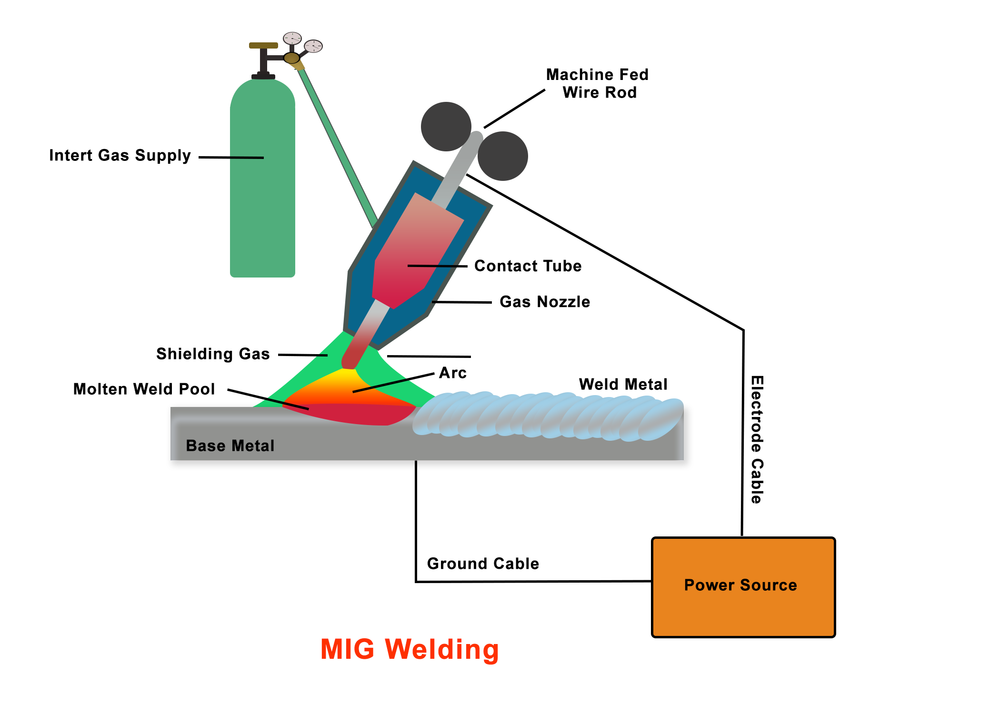
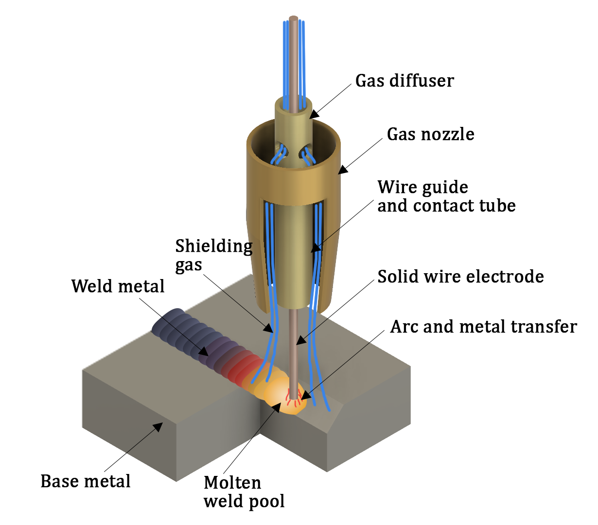
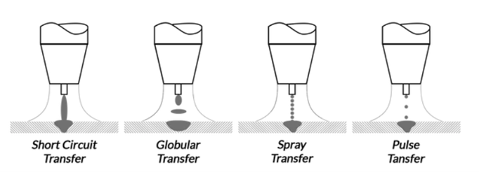
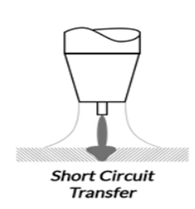
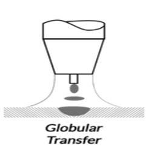
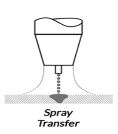
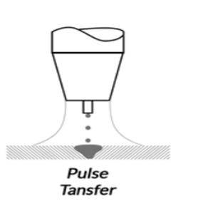
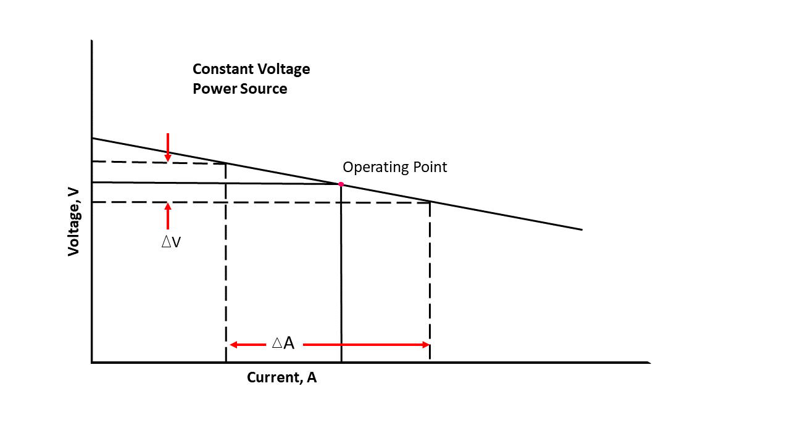

#  Introduction

The welding procedure known as Metal Inert Gas welding, otherwise called as Gas Metal Arc Welding (GMAW), uses a constant feeding of wire as the electrode and an inert or semi-inert shielding gas to prevent the weld from outside contamination. In GMAW welding, the workpiece and the constantly supplied wire electrode form an arc that melts the filler metal and the base metal to form a weld pool. The gas protects the weld pool from air contamination, resulting in a high-quality weld. Due to its fast welding speeds, minimum workpiece preparation requirements, low spatter, and extensive application, GMAW welding is often employed in a variety of sectors, including the automotive, building, and shipbuilding industries.

####  Fig. 1: The figure illustrates the process of GMAW welding

####  Fig. 2: The figure illustrates the process of GMAW welding

# Theory:
In GMAW (Gas Metal Arc Welding), DC current with reverse polarity is preferred for better arc stability and improved metal deposition. The consumable electrode is fed into the arc through the electrode holder, melting and depositing in the weld simultaneously. A motor with adjustable speed controls the wire feed from a spool into the arc. When it comes to the shielding gas, Argon, CO2 and argon/CO2 mixtures are commonly used for welding various carbon steel sheets.

A GMAW welding setup consists of several important components that work together to create a strong, consistent weld. Some of the most important components include:

1.	Power source: This is the main source of electrical power for the welding process and can be either AC or DC, as well as either constant voltage (CV) or constant current (CC).
2.	Welding wire: This is the filler metal that is fed into the weld joint to create the weld. The selection of Welding wire is contingent on the type of metal being welded and the quality of weld required. Larger diameter wire produces deeper penetration in GMAW welding. It allows for a higher welding current to be used, which in turn generates more heat at the weld site.
3.	Gun: The gun is the handheld device that delivers the welding wire, shielding gas, and electrical power to the weld joint. It typically consists of a trigger, a liner, a contact tip, and a nozzle.
4.	Shielding gas: It protects the weld from contamination and oxidation and helps to create a clean, consistent weld. The selection of shielding gas is contingent on the type of metal being welded and the quality of weld required. Shielding gas can affect the penetration depth of the weld. If the shielding gas used is too reactive, it can cause excessive oxidation and decrease the depth of penetration. On the other hand, an inert gas like argon can provide good penetration depth.
5.	Wire Feed Unit: The role of the wire feeder is to supply a consistent, reliable and uniform flow of wire to the welding area. Maintaining a steady pace of wire feed through the gun assembly is crucial as any variations in wire feed will alter the quality of the weld.
6.	Ground clamp: The ground clamp is used to connect the metal being welded to the power source, and helps to complete the electrical circuit.
7.	Regulator: This is used to regulate the flow of shielding gas and ensure a consistent flow rate.

The molten metal transfer in GMAW welding refers to the process by which the molten electrode forms metal droplets that is transferred to the workpiece to form the weld bead.  In the GMAW process, several kinds of metal transfer are available, such as:
- Short Circuit Transfer
- Globular Transfer
- Spray Transfer
- Pulsed Spray Transfer
 

####  Fig.3 The figure Illustrates different metal transfer Processes

Short Circuit Transfer: In this mode, the welding wire is fed continuously into the weld pool, and the electric current is pulsed on and off in synchronization with the wire feed rate. During each pulse, the wire tip comes into contact with the base metal, creating a short circuit that generates an arc and melts the wire   This type of transfer is typically used for low welding current and low welding speed applications. It can be used for thin materials. It requires low energy. It is possible when voltage < 24 volts and current< 200 amps.
 

####  Fig 4. The figure illustrates the process of Short Circuit Transfer Process

## Globular Transfer: 
In this type of transfer, the electrode is held further away from the workpiece and the filler metal forms into large droplets that transfer to the workpiece and form the weld. This type of transfer is typically used for high welding current and high welding speed applications. It can be employed only for ferrous metals.
 

####  Fig 5. The figure illustrates the process of the Globular Transfer Process

## Spray Transfer:
In this type of transfer, the electrode is held further away from the workpiece, and the filler metal forms into a spray of small droplets that transfer to the workpiece and form the weld. This type of transfer is typically used for high welding current and high welding speed applications and is known for its high heat input and high deposition rate and low spatter. It requires high energy and typically voltage > 25 volts, current >250amps.

####  Fig 6. The figure illustrates the process of the Spray Transfer Process

 

## Pulsed Spray transfer:
In this type of transfer, the welding current and voltage are alternated, controlling the frequency and the dimension of the filler metal droplets that transfer to  workpiece.

It ia variation of spray transfer mode This type of transfer is used to improve the arc stability, reduce the spatter, and control the heat input.

####  Fig 7. The figure illustrates the process of Pulse Spray Transfer Process

## Type of Power source:

1. Constant Voltage Power-source: Constant voltage (CV) power sources, also known as voltage-regulated power sources. The graph shows a horizontal line representing the constant voltage output of the power source. This line does not change much regardless of the current drawn from the power source, indicating that the voltage remains constant   This type of power source is typically used for lighter gauge metals, and provides a consistent arc length and stability, making it ideal for welding aluminium and other non-ferrous metals.

####  Fig.8 Graphical representation of Constant Voltage power source

 
In summary, the components in a GMAW welding setup are crucial to the success of the welding process, and choice of components to use will depend on the requirements of the welding application.

